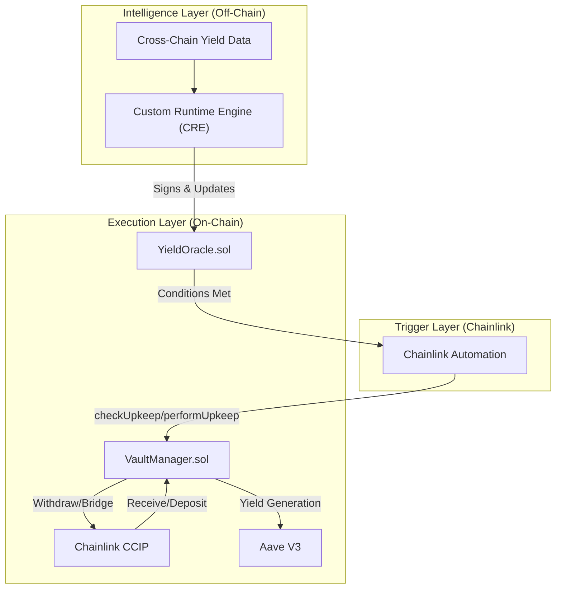

# Use Diego — CrossYield Vault

**Deposit once. Let the vault chase the best yield across chains.**

Use Diego is an autonomous cross-chain yield optimizer designed to fragmentation in DeFi yields. It enables users to deposit stablecoins once and benefit from automatic capital allocation to the chain offering the highest net yield, orchestrated via Chainlink CCIP and Automation.

---

## 🏗 System Architecture

The protocol is built with a modular architecture that separates intelligence, triggering, and execution layers.

### Core Components

| Layer | Component | Responsibility |
| :--- | :--- | :--- |
| **Intelligence** | **CRE** | Reads on-chain data, computes net profitability, and updates the Yield Oracle. |
| **Trigger** | **Chainlink Automation** | Monitors conditions and triggers rebalancing events autonomously. |
| **Execution** | **Smart Contracts** | Manages user funds, interacts with lending protocols, and handles cross-chain bridging. |

---

## 💡 The Core Innovation: Net Yield Optimization

Unlike basic yield aggregators that chase the highest gross APY, Use Diego calculates the **Net Yield** to ensure rebalancing is actually profitable.

$$ \text{Net Yield} = \text{Gross APY} - (\text{Bridge Cost} + \text{Gas Fees} + \text{Slippage}) $$

Rebalancing only occurs if:
$$ \Delta\text{Yield} \times \text{Capital} > \text{Total Rebalance Costs} $$

---

## 🛠 Features & Flows

### 💰 One-Click Deposit
Users deposit USDC on any supported chain. The `VaultManager` issues proportional shares (receipt tokens) and immediately deploys the capital into local lending protocols (e.g., Aave).

### 🔄 Autonomous Rebalancing
When a significant yield opportunity is detected on another chain:
1. **Withdrawal**: Funds are pulled from the source chain lending pool.
2. **Bridging**: Capital is transferred via **Chainlink CCIP**.
3. **Deployment**: Target chain receives funds and deposits them into the local high-yield pool.
4. **State Sync**: Vault shares reflect the global unified liquidity.

### 🛡 Security & Trust Model
*   **Non-Custodial**: Funds are always held in audited-style smart contracts (prototype status), not by operator keys.
*   **Explicit Triggers**: Only authorized Chainlink Forwarders can execute rebalancing logic.
*   **Layered Trust**: While the `YieldOracle` currently relies on CRE-signed data, the execution path remains constrained by programmed logic.

---

## 🚀 Tech Stack

*   **Smart Contracts**: Solidity `^0.8.20`, Foundry/Hardhat.
*   **Orchestration**: Chainlink CCIP, Chainlink Automation v2.1.
*   **Lending Integration**: Aave V3.
*   **Off-chain Intelligence**: Custom Runtime Engine (CRE) - Node.js/TypeScript.
*   **Frontend**: Nextjs.

---

## 🔮 Roadmap
- [ ] Decentralized Oracle signing for yield data.
- [ ] Multi-protocol strategy expansion.
- [ ] Advanced slippage and price impact protection.
- [ ] Support for non-EVM chains via CCIP.